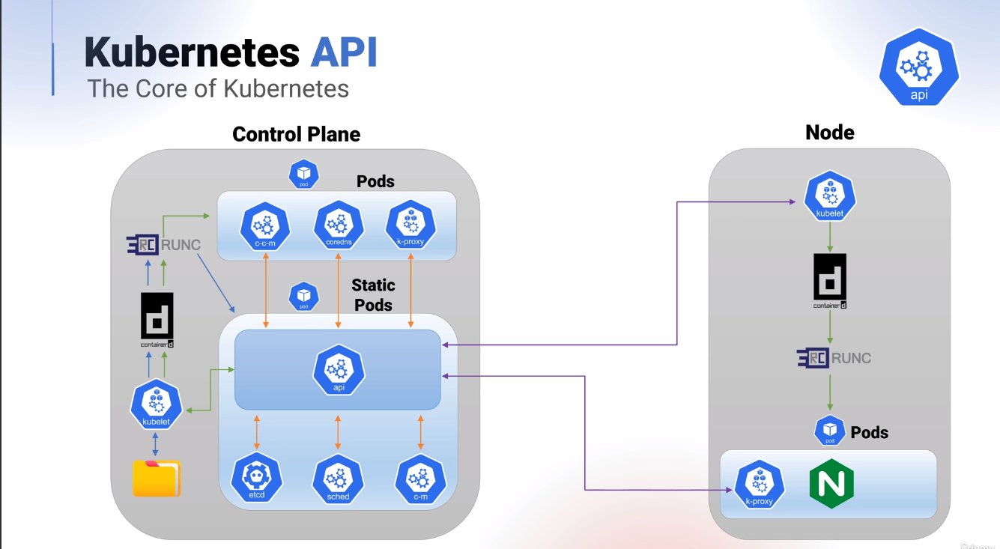

The KCNA Examination focusses on the theory of the API and particular attention should be made for the following areas -

How CRD's can be used to extend the Kubernetes API

How to list resource types in a cluster

The use of --authorization-mode

The main three stages a request will pass through on its journey via the API server

