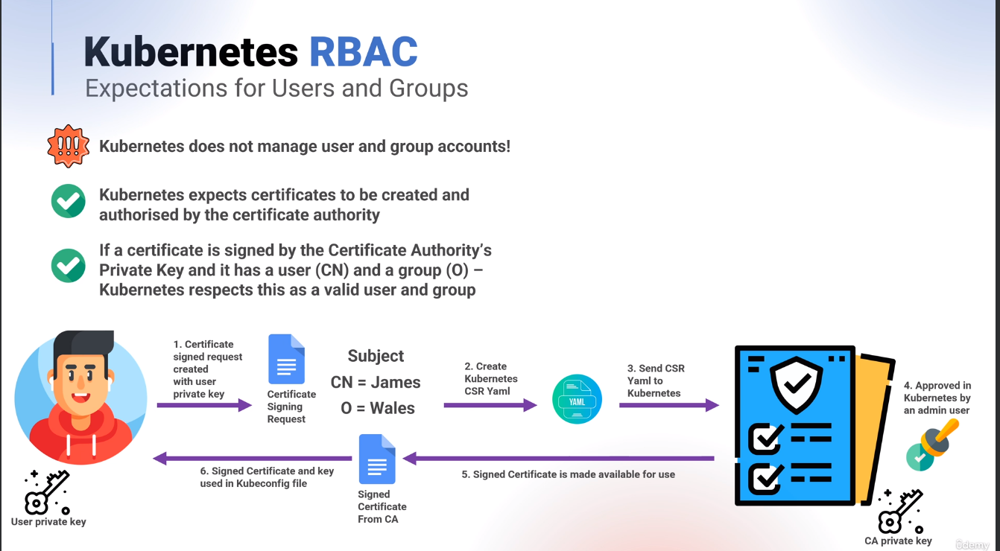

# Important commands

kubectl create clusterrole cluster-superhero --verb="*" --resource="*"

kubectl create rolebinding cluster-superhero --clusterrole=cluster-superhero --group=cluster-superheroes

verify

kubectl auth can-i '*' '*'

# Configuring an RBAC User/Group Manually

We'll see how we can configure a user/group for use with RBAC from scratch, first we'll start by generating an rsa private key for our user batman -

openssl genrsa -out batman.key 4096

We'll now create a certificate signing request, we'll reference our private key, an output file and we'll specify the subject information with CN and O for our user and group -

openssl req -new -key batman.key -out batman.csr -subj "/CN=batman/O=cluster-superheroes" -sha256

And if you wish you can review the files -

cat batman.key

cat batman.csr

We'll now structure a CSR signing request, first we'll create variables with our data -

CSR_DATA=$(base64 batman.csr | tr -d '\n')

CSR_USER=batman

And if we check these, both will now be set -

echo $CSR_DATA

echo $CSR_USER

Let's template a Kubernetes Certificate Signing Request as yaml, we'll use placeholders for our variables and will redirect to a file -

cat <<EOF > batman-csr-request.yaml
apiVersion: certificates.k8s.io/v1
kind: CertificateSigningRequest
metadata:
  name: ${CSR_USER}
spec:
  request: ${CSR_DATA}
  signerName: kubernetes.io/kube-apiserver-client
  usages:
  - client auth
EOF

And if we check our file, we will see these entries populated -

cat batman-csr-request.yaml

We'll apply this request -

kubectl apply -f batman-csr-request.yaml

And if we check in Kubernetes we will see this certificate signing request as pending -

kubectl get certificatesigningrequest

We can use the shorthand of csr which is more commonly used in these circumstances -

kubectl get csr

As our current super user we'll approve this request -

kubectl certificate approve batman

And if we check again, we will have an approved csr -

kubectl get csr

If we query the signed certificate using json as output, we will be able to see our certificate in base64 -

kubectl get csr batman -o json

To directly capture this entry, we'll use jsonpath and will tell it to walk the path of status, then certificate -

kubectl get csr batman -o jsonpath='{.status.certificate}'

At the moment this is base64 so let's decode this -

kubectl get csr batman -o jsonpath='{.status.certificate}' | base64 -d

And we'll redirect this to a file -

kubectl get csr batman -o jsonpath='{.status.certificate}' | base64 -d > batman.crt

And now we have the following files -

ls -l

We can use openssl to decode the approved/signed certificate, showing that the subject line contains CN and O -

openssl x509 -in batman.crt -text -noout

Adding Information to a Kubeconfig file
Let's use our existing kubeconfig file as a template -

cp /root/.kube/config batman-clustersuperheroes.config

If we take a look, this currently has a lot of information that we don't want our batman user to have -

cat batman-clustersuperheroes.config

Let's clean this file, we'll use the KUBECONFIG variable and we'll unset users.default -

KUBECONFIG=batman-clustersuperheroes.config kubectl config unset users.default

We'll delete the current context -

KUBECONFIG=batman-clustersuperheroes.config kubectl config delete-context default

And we'll unset the current context -

KUBECONFIG=batman-clustersuperheroes.config kubectl config unset current-context

Our base file is now simplified -

cat batman-clustersuperheroes.config

Let's embed the new information, first set-credentials as batman, we'll pass the certificate data and the private key, we'll also embed this information -

KUBECONFIG=batman-clustersuperheroes.config kubectl config set-credentials batman --client-certificate=batman.crt --client-key=batman.key --embed-certs=true

Set the default context to use the default cluster with a user of batman -

KUBECONFIG=batman-clustersuperheroes.config kubectl config set-context default --cluster=default --user=batman

And use the context of default -

KUBECONFIG=batman-clustersuperheroes.config kubectl config use-context default

Now our configuration files looks like the following -

cat batman-clustersuperheroes.config

And we can test that this is working, we'll be able to get nodes, create a pod and delete a pod, essentially our user is a super user -

KUBECONFIG=batman-clustersuperheroes.config kubectl get nodes

KUBECONFIG=./batman-clustersuperheroes.config kubectl run nginx --image=nginx

KUBECONFIG=./batman-clustersuperheroes.config kubectl delete pod/nginx --now

# Automating an RBAC Kubeconfig file
We're going to setup a convenient tool for automating kubeconfig configurations, first install prerequisites -

apt update && apt install -y git jq openssl

We'll clone the project -

git clone https://github.com/spurin/kubeconfig-creator.git

Change into the project directory -

cd kubeconfig-creator

And we'll create another user similar to batman, this time we'll create superman -

./kubeconfig_creator.sh -u superman -g cluster-superheroes

And because superman is also part of the cluster-superheroes group, we can execute commands as if we are a super user -

KUBECONFIG=./superman-clustersuperheroes.config kubectl get nodes

We'll create another user, this time we'll create wonder-woman -

./kubeconfig_creator.sh -u wonder-woman -g cluster-superheroes

And again, she will have full access -

KUBECONFIG=./wonderwoman-clustersuperheroes.config kubectl get nodes

And again, she will have full access -

KUBECONFIG=./wonderwoman-clustersuperheroes.config kubectl get nodes

# Creating a watch only RBAC group
We'll create a ClusterRole that can only read resources with the verbs list,get,watch -

kubectl create clusterrole cluster-watcher --verb=list,get,watch --resource='*'

We'll create our binding and our cluster-viewers group at the same time -

kubectl create clusterrolebinding cluster-watcher --clusterrole=cluster-watcher --group=cluster-watchers

If we check the auth against a user called uatu in this group, we no longer have full access like before -

kubectl auth can-i '*' '*' --as-group="cluster-watchers" --as="uatu"

However if we check, we can observe -

kubectl auth can-i 'list' '*' --as-group="cluster-watchers" --as="uatu"

Let's create a KUBECONFIG file to test this for the uatu user -

./kubeconfig_creator.sh -u uatu -g cluster-watchers

If we run a get nodes, this will work -

KUBECONFIG=./uatu-clusterwatchers.config kubectl get nodes

We can also query pods -

KUBECONFIG=./uatu-clusterwatchers.config kubectl get pods

However, if we try to create something as this user it will fail -

KUBECONFIG=./uatu-clusterwatchers.config kubectl run nginx --image=nginx

# Creating an RBAC managed user
All of our examples so far have been against wildcard ClusterRoles and Verbs, and against groups. Let's try this out for a standalone user, we'll create a ClusterRole as a pod manager with the verbs list,get,create,delete and the resource as pods -

kubectl create clusterrole cluster-pod-manager --verb=list,get,create,delete --resource='pods'

We'll create a ClusterRoleBinding which we'll use to bind to our ClusterRole and a user called deadpool -

kubectl create clusterrolebinding cluster-pod-manager --clusterrole=cluster-pod-manager --user=deadpool

If we check with auth can -i list * we wont be able to do so as deadpool -

kubectl auth can-i 'list' '*' --as="deadpool"

However, if we check against pods, this will be permitted -

kubectl auth can-i 'list' 'pods' --as="deadpool"

If we check the ClusterRoleBindings output, we'll see deadpool as a user at the bottom -

kubectl get clusterrolebindings -o wide

Let's create a KUBECONFIG file again, this time we wont use the group, just the user and observe the output, there will be no O entry as the subject line -

./kubeconfig_creator.sh -u deadpool

If we try to access pods as this user, it will work -

KUBECONFIG=./deadpool.config kubectl get pods

But if we try and access secrets, it will fail -

KUBECONFIG=./deadpool.config kubectl get secrets

# Using Roles and RoleBindings
Let's switch to Roles and RoleBindings which are a namespaced resource, first we'll create a namespace called gryffindor -

kubectl create namespace gryffindor

We'll create a role, in this new namespace with full access -

kubectl -n gryffindor create role gryffindor-admin --verb='*' --resource='*'

And we'll create a RoleBinding and specify our group -

kubectl -n gryffindor create rolebinding gryffindor-admin --role=gryffindor-admin --group=gryffindor-admins

If we check our auth against the group, we'll be rejected if we don't specify a namespace, however, if we do it will work as expected -

kubectl auth can-i '*' '*' --as-group="gryffindor-admins" --as="harry"

kubectl -n gryffindor auth can-i '*' '*' --as-group="gryffindor-admins" --as="harry"

Let's create a kubeconfig file to check this as well, we'll use our convenient tool to do so and we'll set the namespace as we execute -

./kubeconfig_creator.sh -u harry -g gryffindor-admins -n gryffindor

If we check our configuration file, it has a namespace set -

cat harry-gryffindoradmins.config

If we try and access anything outside of a namespace it will fail -

KUBECONFIG=./harry-gryffindoradmins.config kubectl get nodes

If we try and access pods in the default namespace, this will also fail -

KUBECONFIG=./harry-gryffindoradmins.config kubectl -n default get pods

However, if we access resources in the gryffindor namespace, it will succeed -

KUBECONFIG=./harry-gryffindoradmins.config kubectl get pods

